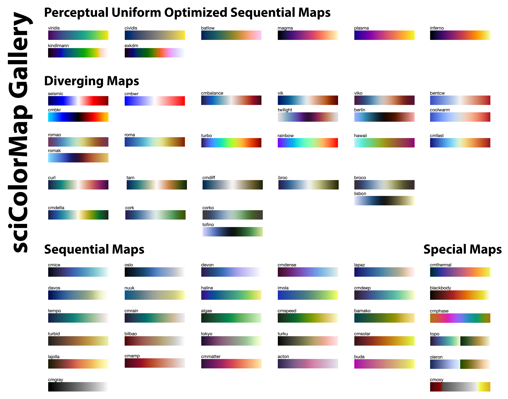
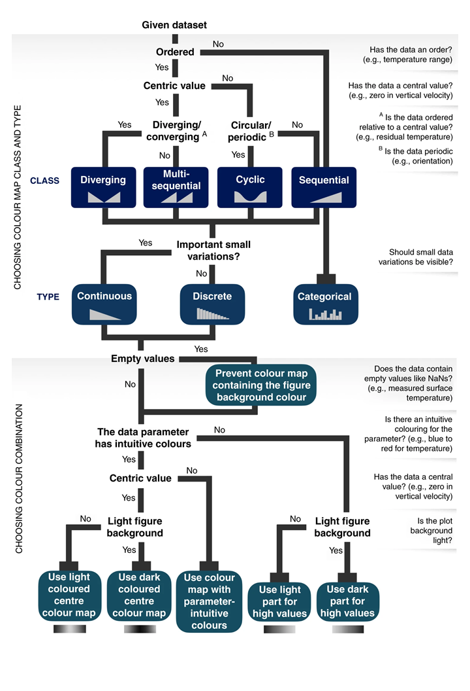

# sciColorMaps

This is an enhanced MATLAB colormap package containing more than 60 colormaps optimized for scientific data visualization.

## Gallery

use `show_gallery.m` to show all color maps with name

use `show_cm(name)` to show a specific color map

## Source
These colormaps are obtained from:

1. [Matplotlib](https://matplotlib.org/3.3.3/tutorials/colors/colormaps.html)

2. [cmocean](https://matplotlib.org/cmocean/)

3. [Scientific Colour Map 6.0](http://www.fabiocrameri.ch/colourmaps.php)

4. [Color Map Advice for Scientific Visualization](https://www.kennethmoreland.com/color-advice/)

Contact me for any copyright conflits.

## How to use

1. Add the folder to MATLAB path and call the name of each colormap *exactly the same way* as MATLAB built-in colormap, e.g.:

`colormap(viridis)`

`colormap viridis`

`cm = viridis(128);`

2. Use `show_gallery.m` to show all color maps with name

3. Use `show_cm(name)` to show a specific color map

## Guideline to choose the right color map (adapt from reference 1)

recommand to use the perceptial uniform optimized color maps for better visual accessibility (ref1)

## reference

1. Crameri, Fabio, Grace E. Shephard, and Philip J. Heron. "The misuse of colour in science communication." Nature communications 11.1 (2020): 1-10.
2. https://www.kennethmoreland.com/color-advice/
3. Kindlmann, G., Reinhard, E., & Creem, S. (2002, October). Face-based luminance matching for perceptual colormap generation. In IEEE Visualization, 2002. VIS 2002. (pp. 299-306). IEEE.